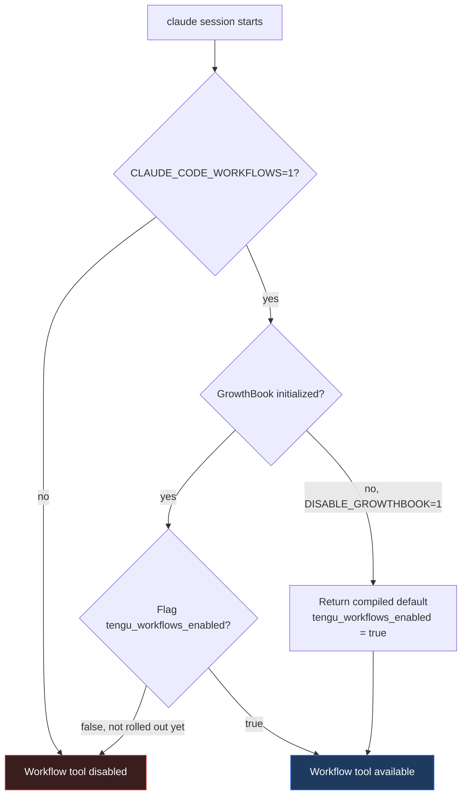
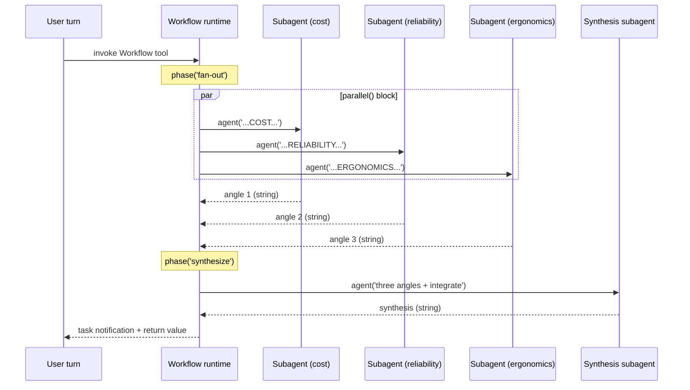
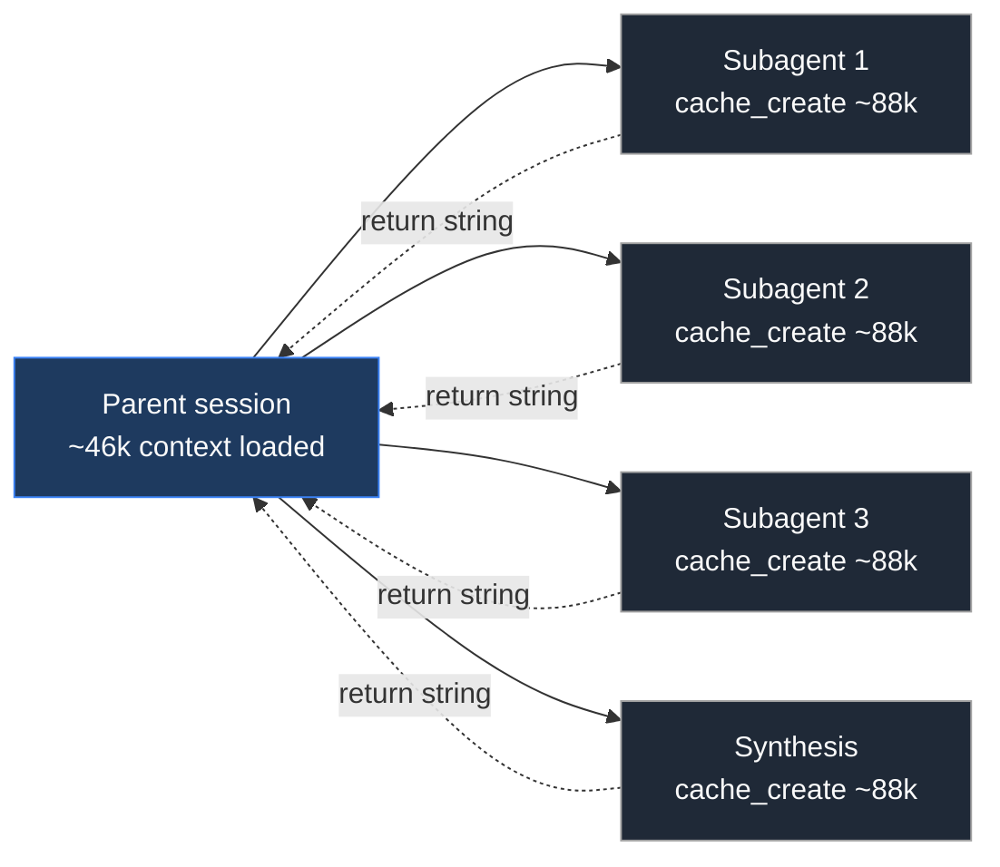

**The short version:** Claude Code v2.1.147 shipped a Workflow tool for deterministic multi-agent orchestration. It is off by default and double-gated, so almost no one has tried it yet. Setting `CLAUDE_CODE_WORKFLOWS=1` alone is not enough. A second feature flag, `tengu_workflows_enabled`, is still rolling out through Anthropic's GrowthBook setup. You can bypass it with `DISABLE_GROWTHBOOK=1`, which forces the flag-reader to fall through to the compiled default of `true`. Once enabled, the tool gives you sandboxed JavaScript primitives (`agent()`, `parallel()`, `pipeline()`, `phase()`) that compose subagents under a shared token budget, with structured outputs and resume-by-run-id. Public discourse is essentially empty. The first wave of people writing about it can shape how everyone else thinks about the abstraction.

---

## What shipped

The changelog entry is one line:

> Workflow Tool: New tool for deterministic multi-agent orchestration. Off by default; enable with `CLAUDE_CODE_WORKFLOWS=1`.

That is the entire public surface area. No docs, no examples, no blog post from Anthropic. The official Claude Code documentation site has nothing about it as of this writing. The phrase "deterministic multi-agent orchestration" is doing a lot of work in that sentence, and the rest of this post is about what it actually means.

Everything below comes from two sources: extracting strings out of the v2.1.147 Mach-O binary (`~/.local/share/claude/versions/2.1.147`), and running the tool live once the override was figured out.

## The double-gate problem

The first thing to know is that the changelog's enable instruction is incomplete. The actual gate function inside the binary looks like this:

```js
function isWorkflowsEnabled() {
  if (!process.env.CLAUDE_CODE_WORKFLOWS) return false;
  return getFeatureFlag("tengu_workflows_enabled", /* default */ true);
}
```

Two conditions, both required. The env var has to be set, AND the GrowthBook feature flag `tengu_workflows_enabled` has to evaluate to true for your account. The second condition is the part the changelog skipped.

There's a way around it. The feature-flag reader checks two local override maps first, then asks GrowthBook. If GrowthBook isn't initialised, the reader returns the compiled default value. The compiled default for `tengu_workflows_enabled` is `true`. So if you disable GrowthBook entirely, the flag-reader hits the default and returns true:

```bash
CLAUDE_CODE_WORKFLOWS=1 DISABLE_GROWTHBOOK=1 claude
```

The actual control flow:



This is the recipe that gets the Workflow tool to surface in your session. Caveat: `DISABLE_GROWTHBOOK=1` turns off all remote feature flags, not just this one. Other experimental rollouts will also fall back to compiled defaults. That's usually fine for a single session, but I would not put this in your shell profile.

For spawned background sessions (via `claude --bg` or wrapper scripts like `spawn-cc-session.py`), the env var only propagates if you spawn in foreground mode. Background workers inherit env from the supervisor daemon's start environment, not from the calling shell, so background spawning will silently fail to get the flag.

## What it actually does

The Workflow tool is a sandboxed JavaScript runtime. You pass it a script (inline as `script`, by path as `scriptPath`, or by name from `~/.claude/workflows/`), and the script orchestrates subagent calls.

Here is a minimal example that runs three subagents in parallel and synthesises their outputs:

```js
export const meta = {
  name: 'parallel-research-demo',
  description: 'Three parallel research agents plus a synthesis agent.',
  phases: [
    { title: 'fan-out' },
    { title: 'synthesize' }
  ]
}

const topic = args?.topic || 'agent orchestration patterns'

phase('fan-out')
const angles = await parallel([
  () => agent(`Give a concise angle on "${topic}" from the perspective of COST.`, { label: 'cost' }),
  () => agent(`Give a concise angle on "${topic}" from the perspective of RELIABILITY.`, { label: 'reliability' }),
  () => agent(`Give a concise angle on "${topic}" from the perspective of ERGONOMICS.`, { label: 'ergonomics' })
])

phase('synthesize')
const synthesis = await agent(
  `Three angles:\n\nCOST: ${angles[0]}\n\nRELIABILITY: ${angles[1]}\n\nERGONOMICS: ${angles[2]}\n\n` +
  `Write a 120-word synthesis integrating all three.`,
  { label: 'synthesis' }
)

return { topic, angles, synthesis }
```

The execution model:



A few things worth pointing out about that script.

**The `meta` block is mandatory and must be a pure literal.** No variables, no template interpolation, no spreads. The runtime parses it ahead of execution to register the workflow's metadata. If you try to compute any of those values, the script fails to load.

**`parallel()` takes functions, not promises.** The argument is an array of `() => agent(...)` callbacks. The runtime invokes them itself so it can throttle and schedule. Passing `[agent(...), agent(...)]` directly is one of the documented error cases.

**Each `agent()` call is a fresh subagent.** Its system prompt explicitly tells it that its return value is a string parsed by the calling script, not a message to a human. If you want a typed object back instead of a string, pass `schema:` with a JSON Schema, and the runtime forces a structured-output tool call:

```js
const result = await agent('Extract the EPD cost ranges from this text...', {
  schema: {
    type: 'object',
    properties: {
      low_usd: { type: 'number' },
      high_usd: { type: 'number' }
    },
    required: ['low_usd', 'high_usd']
  }
})
// result is a validated { low_usd, high_usd } object, not a string
```

**Determinism is real.** Inside the sandbox, `Date.now()`, `Math.random()`, and argless `new Date()` are stubbed out. Non-determinism has to enter through `args` or be stamped on after the workflow returns. This is what makes resume work: if you re-invoke the same workflow with `resumeFromRunId: 'wf_abc123...'`, completed `agent()` calls with unchanged prompts return their cached results instantly. Only edited or new calls re-run.

**There are real caps.** A hard limit of 1000 `agent()` calls per workflow run (the `WorkflowAgentCapError`). A parallel concurrency cap of `min(16, cores - 2)`. A shared token budget across the main session and all workflows, with a minimum of 20,000 tokens for `task_budget.total`. Exceed the budget and further `agent()` calls throw `WorkflowBudgetExceededError`. Workflows can call other workflows via `workflow(name, args?)`, but nesting is exactly one level deep. Deeper nesting throws.

## What it costs

A one-agent smoke test ("Say PARROT and nothing else") cost 62,991 tokens and ran in 2.9 seconds. A four-agent pilot (the parallel-research script above) cost 362,786 tokens and ran in 24.3 seconds.

Those numbers are surprisingly high, and the reason is worth understanding.

Pulling the raw `usage` stamps out of each subagent's JSONL transcript, every subagent in the four-agent run paid roughly the same input cost:

| Subagent | cache_create | cache_read | input | output | total |
|---|---:|---:|---:|---:|---:|
| agent 1 | 85,940 | 10,131 | 6 | 357 | 96,434 |
| agent 2 | 88,883 | 0 | 6 | 2 | 88,891 |
| agent 3 | 88,887 | 0 | 6 | 2 | 88,895 |
| agent 4 | 88,901 | 0 | 6 | 422 | 89,329 |

The 88,000 tokens of `cache_creation_input_tokens` per subagent is the parent session's full context, replicated into the subagent: my user-level CLAUDE.md (around 21,000 tokens once its imports expand), the project CLAUDE.md from the directory I spawned in (around 15,000), Claude Code's system prompt, the full tool catalogue, MCP server descriptions, and auto-loaded skills. The actual prompt the script passed to each subagent ("Give a concise angle on X") is 6 tokens. Everything else is context replication.

Visually, the cost picture is parent context replicated into every subagent:



This matters for two reasons.

**The intrinsic per-step overhead of the Workflow tool is small.** Strip CLAUDE.md and you're paying maybe 10,000-15,000 tokens of system prompt and tool definitions per call. The "Workflow agents cost 60-90k each" framing is misleading. What costs that much is loading your CLAUDE.md, twice, once for the parent session and once for each subagent.

**`parallel()` siblings do not share prompt cache.** Only agent 1 got any cache reads, because it ran sequentially after the parent's initial cache_create. Agents 2, 3, and 4 ran concurrently and each paid the full cache_creation cost again. So `parallel([f1, f2, f3])` is approximately 3x the parent's context size, not 1x with two cheap reads. For fan-out workloads, this is a real ergonomic loss.

The practical upshot: if you want cheap Workflow fan-out, you have three options. Keep your CLAUDE.md small. Or run your parent session with `--bare`, which skips CLAUDE.md auto-discovery. Or accept that subagents won't have repo context and pass any necessary facts through the prompt manually.

## Where it wins, where it loses

I picked the parallel-research-and-synthesise pattern for the pilot because it is the canonical use case in my own orchestration setup: spin up several research sessions in parallel, then combine their findings. It is what the orchestrate skill in my Claude Code config does today, using `spawn-cc-session.py` to launch separate Claude Code sessions and a smart-monitor script to detect completion.

For this pattern, Workflow has clear advantages.

**Latency.** 24 seconds end-to-end for four agents. The spawn-based equivalent takes 3 to 5 minutes minimum, because each spawned session has to boot, register hooks, write its first JSONL line, and get picked up by the monitor.

**Determinism and resume.** The `resumeFromRunId` mechanism is genuinely new. Nothing in the spawn-based world gives you "re-run the workflow, return cached results for unchanged steps, only re-execute what changed." That alone is worth the price of admission for iterative pipelines.

**Structured outputs.** Pass a JSON Schema to `agent()`, get a validated object back. No more parsing markdown out of subagent responses. Combined with `isolation: 'worktree'` for parallel file-mutating agents, this covers a lot of patterns that previously required custom orchestration code.

The losses are also clear.

**Subagent context is whatever the parent has loaded.** Workflow subagents inherit the parent session's CLAUDE.md and tool catalogue. If you want repo-specific knowledge, you pay for it in cache_create tokens, per subagent, per parallel branch. Spawned sessions can be more efficient here, because each one only loads context relevant to its working directory and runs longer to amortise that cost.

**Same-session resume only.** You cannot pause a workflow overnight and pick it up tomorrow in a new session. The `resumeFromRunId` mechanism requires the workflow's parent session to still be alive.

**No durable orchestration substrate.** Workflows are scoped to a single Claude Code session. There is no equivalent of the supervisor-managed background workers, no roster persistence, no respawn-on-binary-update. For multi-day or multi-machine orchestration, the spawn-based primitives are still the answer.

**The token math gets ugly for repo-specific work.** If subagents need full project context, you are paying for CLAUDE.md replication on every fan-out branch. For a heavy CLAUDE.md and a 10-way parallel call, that's enough tokens that the cost flips against you compared to spawning a single session that does sequential work.

## What's still unresolved

A few open questions I couldn't answer from the binary alone.

The 1000-agent cap appears to be hardcoded, not configurable through `task_budget` or any visible flag. For deep autonomous workflows, that ceiling will bite eventually.

The lack of inter-sibling prompt-cache sharing in `parallel()` may be an Anthropic backend choice rather than a Workflow tool choice. It's worth watching whether this changes, because it would significantly improve the cost picture for fan-out workloads.

Documentation will land eventually. When it does, some of the recipes here may be obsolete: in particular, `tengu_workflows_enabled` will presumably flip to true on the default channel, at which point the `DISABLE_GROWTHBOOK=1` hack stops being necessary.

For now, though, the tool works. The interesting question is what you build with it.

If you try it and run into something the binary archaeology missed, I'd be curious to hear what.

[^changelog]: Claude Code changelog, v2.1.147 entry. https://code.claude.com/docs/en/changelog
