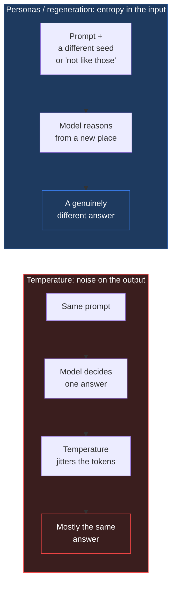
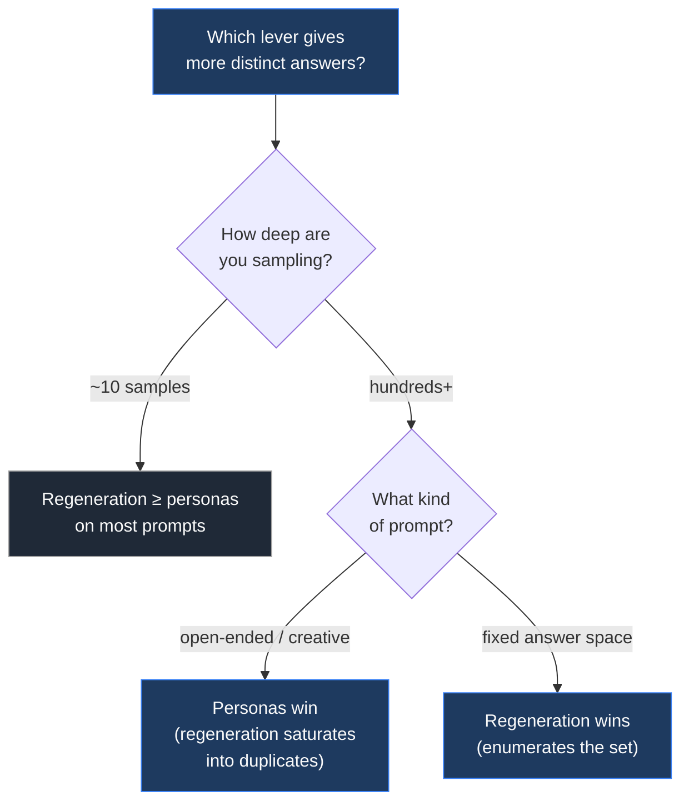

**The short version:** If you ask a language model the same open-ended question ten times, most of the answers come back as rephrasings of each other. On gemini-2.5-flash you get about four genuinely distinct answers out of ten. The reflex fix is to raise the temperature. That barely works: a ladder from 0.2 to 2.0 landed at 3.96 distinct out of 10, against 3.94 for leaving the default, and the answers got slightly worse. Two other levers do work, and both share a mechanism. They inject the diversity through the input rather than the decoder. Seeding each call with a different persona roughly doubles the distinct count. Showing the model its own previous answers and asking for a different one nearly triples it, and answer quality goes up rather than down. The two fix different kinds of prompt, they stack, and the ranking between them flips once you sample deep enough.

---

## The problem

A lot of useful work with LLMs is generate-and-select: produce many candidates, then pick the best one. Brainstorming names or ideas, generating synthetic training data, drafting several approaches to a problem and choosing. All of it depends on the candidates actually being different from each other. If ten samples collapse into three ideas wearing different clothes, the "select" step has almost nothing to select from.

I've been running a research project on exactly this: how an agent should explore a space of candidates and pick well. The measurement tool is NoveltyBench, a public benchmark that scores how many distinct answers a model produces for a prompt.[^nb] The headline metric is `distinct_k`: sample the same prompt `k` times, cluster the answers by meaning, and count the clusters. A perfect run of ten fully different answers scores 10. Ten paraphrases of one answer score 1.

The baseline is worse than most people expect. On NoveltyBench's curated prompt set, gemini-2.5-flash sampled ten times scores **3.94 distinct out of 10**. Six of every ten answers are duplicates of one of the other four.

## The obvious knob does almost nothing

Temperature is the control everyone reaches for. It reshapes the token probability distribution at sampling time: higher temperature flattens it, so lower-probability tokens get picked more often. More randomness in, more variety out. That is the intuition, and on this benchmark it is mostly wrong.

I ran a temperature ladder, sampling across 0.2, 0.6, 1.0, 1.4, and 2.0 instead of a fixed value. The result was an almost exact null:

| Configuration | distinct_10 | quality (utility_10) |
|---|---:|---:|
| Default temperature | 3.94 | 3.68 |
| Temperature ladder 0.2 → 2.0 | 3.96 | 3.23 |

Distinct count moved by 0.02. Answer quality dropped. (The quality column is `utility_k`, a reward-model score that credits answers for being both distinct and good, so a diversity method that produces distinct-but-worse answers shows up here.)

Sampling deeper explains why. Temperature *is* a real lever, but its effect is gated by the shape of the prompt's answer distribution. For a prompt with a broad natural spread of answers ("give me an emoji"), pushing to temperature 2.0 reached 53 distinct answers where 0.2 reached 4. For a prompt with one dominant answer ("solve this riddle"), even temperature 2.0 could not escape the mode: it produced 1 to 3 distinct answers no matter how hot it ran. Temperature can widen a distribution that is already wide. It cannot manufacture variety where the model is confident about one answer. Average those two behaviours across a whole benchmark and they wash out.

## What moves the number: change the input

The two levers that work both leave the decoder alone and change what goes into the model. Both come from the NoveltyBench paper's own experiments;[^nb] what I add here is measuring them against each other, making them cheap to deploy, and testing what happens at depth.

**Persona seeding.** Draw a different random persona for each of the ten calls and condition the answer on it: "Given your background and interests, `{task}`." The personas come from a large public persona dataset, so each call starts from a different vantage point.

**In-context regeneration.** Make the ten calls sequential. Each call sees the answers already produced and is asked for one that differs from all of them. The model repels from its own previous outputs.

Both beat the baseline by a wide margin, and regeneration does it while *improving* quality:

| Configuration | distinct_10 | quality (utility_10) |
|---|---:|---:|
| Baseline (naive resample) | 3.94 | 3.68 |
| Temperature ladder | 3.96 | 3.23 |
| Persona seeding | 7.49 | 4.13 |
| In-context regeneration | 8.45 | 5.95 |

The framing that helped me most: the entropy has to enter through the input. Temperature adds noise to the last step of the pipeline, after the model has already decided what it thinks. Personas and regeneration change what the model is reasoning about in the first place. One shifts the starting point, the other adds a constraint ("not like those"). Both are upstream of the decision, and that is where variety survives.

## They fix different kinds of prompt

Persona seeding and regeneration are not competitors so much as complements. Broken out by prompt category, they cover different weaknesses. Personas carry the open-ended, taste-driven prompts. Regeneration carries the factual and subjective ones, where the win is systematically working through a known answer space instead of returning the most obvious entry every time.

| Category | Personas (distinct) | Regeneration (distinct) |
|---|---:|---:|
| Creativity | 8.4 | 7.4 |
| Random generation | 7.1 | 5.9 |
| Factual knowledge | 6.4 | 9.3 |
| Subjective rankings | 7.5 | 9.4 |

Because they cover different ground, they stack. The most practical setup I measured is regeneration plus a cheap duplicate-repair pass: generate the batch, detect the near-duplicates that slipped through, and regenerate only those. That reached about **9.0 distinct out of 10 while holding quality** (utility 6.08). The duplicate detector does not need to be clever. A word-overlap prefilter plus a cosine-similarity threshold on embeddings recovered about 89% of the gain of a perfect oracle detector, which makes it deployable rather than a benchmark artifact.

## The ranking flips when you sample deep

Here is the caveat that stops this from being a simple "regeneration wins" story, and it is the part I find most interesting.

Everything above is measured at ten samples per prompt. That is a realistic budget for most generate-and-select work. But it is a specific budget, and the ranking between the levers does not survive a change to it. I pushed a few prompts to **1,000 samples each** to see what the deep regime looks like.

Regeneration saturates. Its whole advantage is repelling from previous answers, but a model can only hold so many previous answers in context, and once it has covered its reachable answers it starts cycling. At 1,000 samples the windowed version's distinct answers were only 2 to 8% of the samples: on one prompt it found 18 distinct answers and then produced them over and over for the remaining 982 calls.

Personas do not saturate the same way. Each persona is an independent draw, so the method keeps opening new territory as you sample. On the open-ended prompts, the persona curve crossed above regeneration early and then ran away from it. On one creative prompt, personas reached 834 distinct answers at depth where the best regeneration variant reached 148.

But not on every prompt. On a factual prompt with an externally fixed answer space (name a real thing that satisfies a constraint), regeneration stayed ahead at every depth, because systematically enumerating a known set beats sampling personas that keep rediscovering the same common answers.

The lesson is that "which diversity method is best" is not a property of the method. It is a property of the method, the sampling depth, and the prompt category together. A ranking measured at ten samples does not port to a deep-sampling pipeline.

## Where I land

A few things I now believe, with the scope caveats attached.

**Temperature is not a diversity knob.** It jitters the output of a decision the model has already made. If you need genuinely different answers, spend your effort on the input: seed the calls differently, or let each call see and avoid the previous ones.

**Match the lever to the budget and the task.** For a handful of samples, in-context regeneration plus a cheap repair pass is the strongest single setup and it improves quality. For deep sampling on open-ended tasks, personas keep producing new material where regeneration has run dry. When both matter, stack them.

**More samples is not the same as more diversity.** Across everything I measured, deep sampling saturates: the growth in distinct answers follows a roughly logarithmic curve, and I found no heavy tail of rare, much-better outputs hiding out past the samples you would normally take. The win comes from shifting the distribution you sample from, not from cranking the sample count. Pick the right lever instead of paying for a thousand near-duplicates.

The honest scope: this is one base model (gemini-2.5-flash) on one benchmark (NoveltyBench), and the ordering between personas and regeneration is model-specific. Other work on similar methods has seen the effect size change by a large factor between models, so I would not assume the exact rankings transfer without re-measuring. What has held across everything I have tested is the shape: temperature does little, and the entropy that matters enters through the input.

If you are building generate-and-select machinery and have measured something that cuts against this, I'd be curious to hear what.

[^nb]: NoveltyBench: Evaluating Language Models for Humanlike Diversity. The distinct-answer metric, the curated prompt set, and both the persona and in-context-regeneration baselines are from the paper and its §4.3 experiments. [arXiv:2504.05228](https://arxiv.org/abs/2504.05228)
